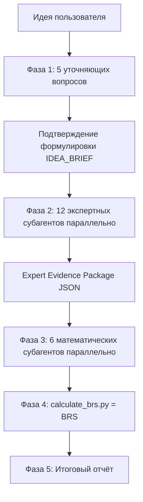

# Business Idea Evaluator

> Объективная оценка бизнес-идей через 18 независимых субагентов, градацию доказательности, вероятностное моделирование и детерминированный **Business Reality Score (BRS)**.

Кросс-платформенный [Agent Skill](https://agentskills.io) для **Claude Code**, **Cursor** и **OpenAI Codex**. Это не мотивационный промпт — это аналитический механизм, который оценивает идею как профессиональный аналитик, а не подстраивается под ожидания пользователя.

---

## Зачем

Большинство «оценок идей» от ИИ — это вежливое поддакивание. Этот скилл устроен иначе:

- **Не льстит.** Запрещённые фразы вроде «отличная идея» и «огромный рынок» — только при наличии доказательств.
- **Не оценивает с ходу.** Сначала 5 уточняющих вопросов, чтобы понять реальную бизнес-конструкцию.
- **Не полагается на «ощущения» главного агента.** Итог считает математический слой (`calculate_brs.py`), а не модель «на глаз».
- **Использует реальных субагентов.** 12 экспертных + 6 математических, каждый в своём контексте.

---

## Как это работает



| Фаза | Что происходит |
|------|----------------|
| **1. Discovery** | Ровно 5 зависимых вопросов, по одному за сообщение → краткое «Я понял идею так: …» → подтверждение |
| **2. Expert layer** | 12 экспертов параллельно собирают факты, оценки 0–10, источники, риски |
| **3. Math layer** | 6 математиков независимо обрабатывают пакет доказательств |
| **4. Scoring** | `calculate_brs.py` считает BRS (мультипликативная модель + блокирующие ограничения) |
| **5. Report** | Вердикт строится из расчёта, а не из мнения |

### 18 субагентов

**Экспертный слой (01–12):**

| # | Субагент | Зона |
|---|----------|------|
| 01 | analog-research | Deep Research аналогов и заменителей |
| 02 | pain-demand | Реальная боль и готовность платить |
| 03 | audience-behavior | Аудитория и поведение клиента |
| 04 | market-country | Рынок, страна, текущие реалии |
| 05 | trends-longevity | Тренды и срок жизни идеи |
| 06 | monetization | Монетизация и unit-экономика |
| 07 | marketing | Маркетинг и каналы |
| 08 | implementation | Техническая реализуемость |
| 09 | legal-platform | Юридические/платформенные/этические риски |
| 10 | competitive-moat | Защита от копирования |
| 11 | launch-zero | План запуска 7/30/90 дней |
| 12 | red-team | Анти-адвокат: атакует идею |

**Математико-статистический слой (13–18):**

| # | Субагент | Зона |
|---|----------|------|
| 13 | evidence-stats | Индекс доказательности и качества источников |
| 14 | math-model | Формула и веса переменных |
| 15 | scenario-probability | 4 сценария + карта вероятностей |
| 16 | unit-economics | CAC / LTV / churn / маржа |
| 17 | sensitivity | Топ чувствительных параметров |
| 18 | experiments | План проверок с минимумом затрат |

---

## Business Reality Score

Итог — **не среднее арифметическое** (оно скрывает блокирующие риски) и не «сырое» произведение (девять множителей < 1 схлопывают результат в ноль), а **геометрическое среднее** девяти факторов, нормированное в 0–100, с последующими блокирующими ограничениями:

```
BRS = geomean(BasePotential, EvidenceFactor, SourceQuality, Execution, Money,
              Defense, Durability, RiskMultiplier, SensitivityMultiplier) × 100
```

Один очень низкий фактор всё равно резко тянет оценку вниз, а жёсткие блокировки применяются отдельно (см. ниже). Расчёт детерминирован — его делает `calculate_brs.py`, а не модель «на глаз».

**Блокирующие ограничения** (примеры):

| Условие | Максимум BRS |
|---------|--------------|
| `legal_safety < 3` | 35 |
| `willingness_to_pay < 4` | 45 |
| `evidence_index < 3` | 40 (только гипотеза) |
| `LTV < CAC` (реалистичный сценарий) | 30 |
| `blocking_legal_risk` | 25 |

**Вердикт:**

| BRS | Решение |
|-----|---------|
| 65–100 | Тестировать в узком сегменте |
| 45–64 | Переформулировать модель/сегмент |
| 25–44 | Только дешёвые проверки |
| 0–24 | Не запускать в текущем виде |

---

## Установка

### Вариант 1 — клонировать в проект

```bash
# Claude Code / Cursor / Codex — общий путь
git clone https://github.com/2612evgenii-hue/business-idea-evaluator.git
cp -r business-idea-evaluator/business-idea-evaluator .agents/skills/

# Установить субагентов в каталоги платформ
bash .agents/skills/business-idea-evaluator/scripts/install-agents.sh
```

### Вариант 2 — глобально (все проекты)

```bash
git clone https://github.com/2612evgenii-hue/business-idea-evaluator.git
cp -r business-idea-evaluator/business-idea-evaluator ~/.agents/skills/
bash ~/.agents/skills/business-idea-evaluator/scripts/install-agents.sh
```

### Вариант 3 — через Vercel skills CLI

```bash
npx skills add 2612evgenii-hue/business-idea-evaluator
```

### Пути, которые сканируют платформы

| Платформа | Skills | Subagents |
|-----------|--------|-----------|
| Claude Code | `.claude/skills/`, `.agents/skills/` | `.claude/agents/` |
| Cursor | `.cursor/skills/`, `.agents/skills/` | `.cursor/agents/` |
| Codex | `.codex/skills/`, `.agents/skills/` | `.codex/agents/` |

Скрипт `install-agents.sh` раскладывает 18 субагентов по `.cursor/agents/`, `.claude/agents/`, `.codex/agents/` и пользовательским каталогам `~/.*/agents/`.

---

## Использование

В чате агента:

```
/business-idea-evaluator
```

или просто:

```
Оцени бизнес-идею: телеграм-бот, который ищет подрядчиков для ремонта
```

Агент **начнёт с первого уточняющего вопроса**, а не с оценки. После 5 вопросов и подтверждения формулировки запустятся все 18 субагентов, затем посчитается BRS.

### Ручной расчёт BRS

После сбора данных субагентов:

```bash
# из папки business-idea-evaluator/
python3 scripts/validate_input.py examples/sample-input.json
python3 scripts/calculate_brs.py examples/sample-input.json
```

Готовый пример входного файла — [`examples/sample-input.json`](business-idea-evaluator/examples/sample-input.json); схема и формула — в [`references/scoring-formula.md`](business-idea-evaluator/references/scoring-formula.md).

---

## Структура

```
business-idea-evaluator/
├── SKILL.md                       # оркестратор (5 фаз)
├── agents/                        # 18 субагентов
│   ├── biz-eval-01-analog-research.md
│   ├── ...
│   └── biz-eval-18-experiments.md
├── references/
│   ├── discovery-protocol.md      # 5 вопросов
│   ├── expert-evidence-package.md # JSON-схемы
│   ├── scoring-formula.md         # формула BRS + блокирующие правила
│   ├── report-template.md         # шаблон отчёта
│   ├── evidence-status.md         # градация источников
│   └── forbidden-phrases.md       # запрещённые фразы
└── scripts/
    ├── calculate_brs.py           # математический слой (обязателен)
    └── install-agents.sh          # установка субагентов
```

---

## Принципы

1. **Зависимость от идеи, не от промпта.** Оценка не подстраивается под формулировку или энтузиазм пользователя.
2. **Доказательность важнее красноречия.** Каждый факт помечается статусом: подтверждён источником / косвенно / гипотеза / требует проверки.
3. **Без интернета — всё гипотезы.** Если поиск недоступен, рыночные выводы явно понижаются до гипотез.
4. **Считает математика, объясняет агент.** Финальный вердикт — результат расчёта, а не мнение модели.

---

## Требования

- Python 3.8+ (для `calculate_brs.py`, только стандартная библиотека)
- Claude Code, Cursor (2.4+) или Codex с поддержкой субагентов
- Доступ к веб-поиску — желателен (без него выводы помечаются как гипотезы)

---

## Лицензия

[MIT](LICENSE)
