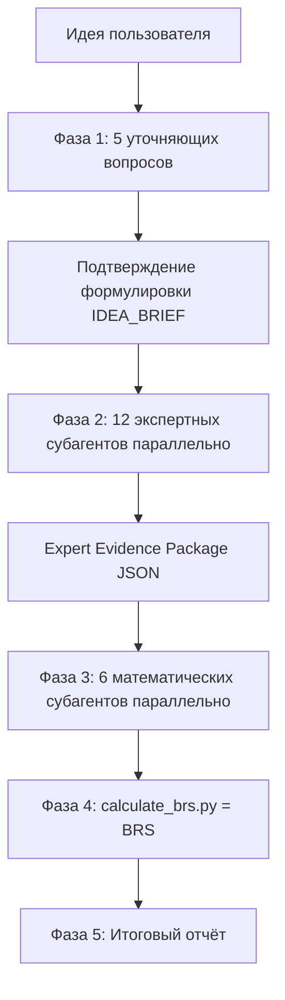

# Business Idea Evaluator

> Объективная оценка бизнес-идей через 18 независимых субагентов, градацию доказательности, вероятностное моделирование и детерминированный **Business Reality Score (BRS)**.

Кросс-платформенный [Agent Skill](https://agentskills.io) для **Claude Code**, **Cursor** и **OpenAI Codex**. Это не мотивационный промпт — это аналитический механизм, который оценивает идею как профессиональный аналитик, а не подстраивается под ожидания пользователя.

---

## Зачем

Большинство «оценок идей» от ИИ — это вежливое поддакивание. Этот скилл устроен иначе:

- **Не льстит.** Запрещённые фразы вроде «отличная идея» и «огромный рынок» — только при наличии доказательств.
- **Не оценивает с ходу.** Сначала 5 уточняющих вопросов, чтобы понять реальную бизнес-конструкцию.
- **Не полагается на «ощущения» главного агента.** Итог считает математический слой (`calculate_brs.py`), а не модель «на глаз».
- **Использует реальных субагентов.** 12 экспертных + 6 математических, каждый в своём контексте.

---

## Как это работает



| Фаза | Что происходит |
|------|----------------|
| **1. Discovery** | Ровно 5 зависимых вопросов, по одному за сообщение → краткое «Я понял идею так: …» → подтверждение |
| **2. Expert layer** | 12 экспертов параллельно собирают факты, оценки 0–10, источники, риски |
| **3. Math layer** | 6 математиков независимо обрабатывают пакет доказательств |
| **4. Scoring** | `calculate_brs.py` считает BRS (мультипликативная модель + блокирующие ограничения) |
| **5. Report** | Вердикт строится из расчёта, а не из мнения |

### 18 субагентов

**Экспертный слой (01–12):**

| # | Субагент | Зона |
|---|----------|------|
| 01 | analog-research | Deep Research аналогов и заменителей |
| 02 | pain-demand | Реальная боль и готовность платить |
| 03 | audience-behavior | Аудитория и поведение клиента |
| 04 | market-country | Рынок, страна, текущие реалии |
| 05 | trends-longevity | Тренды и срок жизни идеи |
| 06 | monetization | Монетизация и unit-экономика |
| 07 | marketing | Маркетинг и каналы |
| 08 | implementation | Техническая реализуемость |
| 09 | legal-platform | Юридические/платформенные/этические риски |
| 10 | competitive-moat | Защита от копирования |
| 11 | launch-zero | План запуска 7/30/90 дней |
| 12 | red-team | Анти-адвокат: атакует идею |

**Математико-статистический слой (13–18):**

| # | Субагент | Зона |
|---|----------|------|
| 13 | evidence-stats | Индекс доказательности и качества источников |
| 14 | math-model | Формула и веса переменных |
| 15 | scenario-probability | 4 сценария + карта вероятностей |
| 16 | unit-economics | CAC / LTV / churn / маржа |
| 17 | sensitivity | Топ чувствительных параметров |
| 18 | experiments | План проверок с минимумом затрат |

---

## Business Reality Score

Итог — **не среднее арифметическое** (оно скрывает блокирующие риски) и не «сырое» произведение (девять множителей < 1 схлопывают результат в ноль), а **взвешенное геометрическое среднее** девяти факторов, нормированное в 0–100, с последующими блокирующими ограничениями:

```
BRS = 100 × weighted_geomean(BasePotential, EvidenceFactor, SourceQuality, Execution,
                            Money, Defense, Durability, RiskMultiplier, SensitivityMultiplier)
```

Веса смещены туда, где провал решает исход (Money и RiskMultiplier — 1.4, BasePotential — 1.3). Дополнительно:

- **Money** гасится unit-экономикой агента 16 (отношение LTV/CAC, маржа, срок окупаемости) — при `LTV < CAC` фактор падает.
- **SourceQuality** ограничен 0.3, если источников нет или `internet_available=false`.
- **Risk** строится на максимуме рисков, причём safety-оценки (`legal_safety` — выше=лучше) и risk-оценки (`failure_risk` — выше=хуже) сначала приводятся к одному направлению, и только потом сравниваются.

Один очень низкий фактор всё равно резко тянет оценку вниз, а жёсткие блокировки применяются отдельно (см. ниже). Расчёт детерминирован — его делает `calculate_brs.py`, а не модель «на глаз».

Скрипт возвращает: `base/min/max`, `confidence`, `evidence_index`, `source_quality_index`, флаг `hypothetical`, `blocking_caps_applied`, `main_blocking_risk`, `main_growth_factor`, `main_uncertainty_factor`, девять `factors`, `probability_map` и `warnings` по входу.

**Блокирующие ограничения** (примеры):

| Условие | Максимум BRS |
|---------|--------------|
| `legal_safety < 3` | 35 |
| `willingness_to_pay < 4` | 45 |
| `evidence_index < 3` | 40 (только гипотеза) |
| `LTV < CAC` (реалистичный сценарий) | 30 |
| `blocking_legal_risk` | 25 |

**Вердикт:**

| BRS | Решение |
|-----|---------|
| 65–100 | Тестировать в узком сегменте |
| 45–64 | Переформулировать модель/сегмент |
| 25–44 | Только дешёвые проверки |
| 0–24 | Не запускать в текущем виде |

---

## Установка

### Вариант 1 — клонировать в проект

```bash
# Claude Code / Cursor / Codex — общий путь
git clone https://github.com/2612evgenii-hue/business-idea-evaluator.git
cp -r business-idea-evaluator/business-idea-evaluator .agents/skills/

# Установить субагентов в каталоги платформ
bash .agents/skills/business-idea-evaluator/scripts/install-agents.sh
```

### Вариант 2 — глобально (все проекты)

```bash
git clone https://github.com/2612evgenii-hue/business-idea-evaluator.git
cp -r business-idea-evaluator/business-idea-evaluator ~/.agents/skills/
bash ~/.agents/skills/business-idea-evaluator/scripts/install-agents.sh
```

### Вариант 3 — через Vercel skills CLI

```bash
npx skills add 2612evgenii-hue/business-idea-evaluator
```

### Пути, которые сканируют платформы

| Платформа | Skills | Subagents |
|-----------|--------|-----------|
| Claude Code | `.claude/skills/`, `.agents/skills/` | `.claude/agents/` |
| Cursor | `.cursor/skills/`, `.agents/skills/` | `.cursor/agents/` |
| Codex | `.codex/skills/`, `.agents/skills/` | `.codex/agents/` |

Скрипт `install-agents.sh` раскладывает 18 субагентов: **Markdown** в `.cursor/agents/`, `.claude/agents/`, `.agents/agents/`, а для Codex **генерирует native TOML** в `.codex/agents/` через `build_codex_agents.py`.

### Установка в Claude Code

1. Скопируйте папку `business-idea-evaluator/` в `.claude/skills/` (проект) или `~/.claude/skills/` (глобально). Имя папки = `name` в `SKILL.md`.
2. `bash business-idea-evaluator/scripts/install-agents.sh` — разложит субагентов в `.claude/agents/`.
3. Claude активирует skill по `description`, когда вы просите оценить бизнес-идею.

### Установка в Cursor

1. Файл правила уже лежит в [`.cursor/rules/business-idea-evaluator.mdc`](.cursor/rules/business-idea-evaluator.mdc) (project rule, тип «Agent Requested»: подключается, когда агент видит запрос на оценку идеи).
2. Скопируйте `business-idea-evaluator/` в `.agents/skills/` и выполните `bash business-idea-evaluator/scripts/install-agents.sh` — субагенты попадут в `.cursor/agents/`.
3. Проверьте, что правило видно в Cursor Settings → Rules. Markdown-субагенты Cursor читает напрямую.

### Установка в Codex

1. Codex читает `AGENTS.md` из корня репозитория автоматически.
2. Сгенерируйте native TOML-субагентов (или просто запустите общий установщик):

```bash
python3 business-idea-evaluator/scripts/build_codex_agents.py .codex/agents
# или
bash business-idea-evaluator/scripts/install-agents.sh
```

3. Codex **не запускает субагентов сам** — попросите явно: «spawn 12 expert agents in parallel», затем «spawn 6 math agents in parallel». Модель/режим наследуются из сессии; expert-агенты помечены `sandbox_mode = "read-only"`.

> Полностью универсального формата субагентов между платформами нет: Cursor/Claude используют Markdown+YAML, Codex — TOML. Поэтому канонический источник — Markdown в `agents/`, а TOML для Codex генерируется из него. Это честная адаптация под каждую платформу, а не «один файл на всех».

---

## Использование

В чате агента:

```
/business-idea-evaluator
```

или просто:

```
Оцени бизнес-идею: телеграм-бот, который ищет подрядчиков для ремонта
```

Агент **начнёт с первого уточняющего вопроса**, а не с оценки. После 5 вопросов и подтверждения формулировки запустятся все 18 субагентов, затем посчитается BRS.

### Ручной расчёт BRS

После сбора данных субагентов:

```bash
# из папки business-idea-evaluator/
python3 scripts/validate_evidence_package.py references/example-input.json
python3 scripts/calculate_brs.py references/example-input.json
```

Готовый пример входа — [`references/example-input.json`](business-idea-evaluator/references/example-input.json), готовый выход — [`references/example-output.json`](business-idea-evaluator/references/example-output.json). Машиночитаемая JSON Schema входа — [`references/evidence-package.schema.json`](business-idea-evaluator/references/evidence-package.schema.json); формула — в [`references/scoring-formula.md`](business-idea-evaluator/references/scoring-formula.md).

Если установлен `jsonschema`, валидатор дополнительно проверяет вход по схеме:

```bash
pip install jsonschema   # опционально — иначе работает встроенная проверка
python3 scripts/validate_evidence_package.py references/example-input.json
```

### Как выглядит вход и выход

Вход (фрагмент):

```json
{
  "idea_brief": "Telegram-бот для поиска проверенных подрядчиков...",
  "internet_available": true,
  "experts": { "02": {"scores": {"pain_strength": 7, "willingness_to_pay": 5, "demand_proof": 4}, "sources": [{"url": "https://..."}]} },
  "math": { "13": {"evidence_index": 4, "source_quality_index": 5}, "16": {"scenarios": {"realistic": {"cac": 600, "ltv": 900}}} }
}
```

Выход (фрагмент):

```json
{
  "business_reality_score": {"base": 47.2, "min": 40.1, "max": 54.3, "confidence": "medium", "verdict_code": "REFORMULATE"},
  "evidence_index": 4.0,
  "hypothetical": false,
  "main_blocking_risk": "failure_risk = 6/10",
  "main_growth_factor": "execution",
  "main_uncertainty_factor": "Готовность платить за подбор не доказана"
}
```

---

## Структура

```
.
├── AGENTS.md                          # инструкции для Codex/Claude/Cursor (корень репо)
├── .cursor/rules/
│   └── business-idea-evaluator.mdc    # Cursor project rule
└── business-idea-evaluator/
    ├── SKILL.md                       # оркестратор (5 фаз)
    ├── agents/                        # 18 субагентов (Markdown)
    │   ├── biz-eval-01-analog-research.md
    │   ├── ...
    │   └── biz-eval-18-experiments.md
    ├── references/
    │   ├── discovery-protocol.md          # 5 вопросов
    │   ├── expert-evidence-package.md     # per-agent JSON-схемы
    │   ├── evidence-package.schema.json   # JSON Schema входа (draft-07)
    │   ├── scoring-formula.md             # формула BRS + блокирующие правила
    │   ├── report-template.md             # шаблон отчёта
    │   ├── evidence-status.md             # градация источников
    │   ├── forbidden-phrases.md           # запрещённые фразы
    │   ├── example-input.json             # пример входа
    │   └── example-output.json            # пример выхода
    ├── scripts/
    │   ├── calculate_brs.py               # математический слой (обязателен)
    │   ├── validate_evidence_package.py   # валидатор входа (+ JSON Schema)
    │   ├── validate_input.py              # обратная совместимость (alias)
    │   ├── build_codex_agents.py          # генерация Codex TOML из Markdown
    │   └── install-agents.sh              # установка субагентов
    └── tests/
        ├── test_brs.py                    # pytest (10 проверок)
        └── run_checks.sh                  # полный quality gate
```

---

## Принципы

1. **Зависимость от идеи, не от промпта.** Оценка не подстраивается под формулировку или энтузиазм пользователя.
2. **Доказательность важнее красноречия.** Каждый факт помечается статусом: подтверждён источником / косвенно / гипотеза / требует проверки.
3. **Без интернета — всё гипотезы.** Если поиск недоступен, рыночные выводы явно понижаются до гипотез.
4. **Считает математика, объясняет агент.** Финальный вердикт — результат расчёта, а не мнение модели.

---

## Проверка работоспособности

Все файлы используют LF-переносы и проходят синтаксические проверки. Воспровести можно одной командой:

```bash
cd business-idea-evaluator
bash tests/run_checks.sh
```

Ожидаемый вывод (фрагмент):

```
== 1. Python syntax (calculate_brs.py) ==  PASS
== 3. Bash syntax (install-agents.sh) ==   PASS
== 5. BRS computation (example) == BRS base=47.2 range=40.1-54.3 verdict=REFORMULATE
== 8. Codex TOML generation (18 agents) == PASS (18 toml)
== 9. Risk-direction regression == safe=0.50 risky=0.10 unsafe=0.20  PASS
== 10. Blocking cap (legal_safety=2 -> cap 35) == cap applied, base = 35  PASS
== 11. pytest suite == 10 passed  PASS
ALL CHECKS PASSED
```

Отдельные команды (quality gate, запускать из корня репозитория):

```bash
python3 -m py_compile business-idea-evaluator/scripts/calculate_brs.py
bash -n business-idea-evaluator/scripts/install-agents.sh
python3 business-idea-evaluator/scripts/validate_evidence_package.py business-idea-evaluator/references/example-input.json
python3 business-idea-evaluator/scripts/calculate_brs.py business-idea-evaluator/references/example-input.json
pytest
```

> Примечание: если открывать raw-файлы через некоторые инструменты предпросмотра, переносы строк могут «схлопываться» в одну строку — это артефакт рендеринга, а не содержимого. В git-блобе хранятся корректные LF-переносы (проверяется `git show HEAD:.../SKILL.md`).

## Ограничения (honest limitations)

Скилл — это **decision-support**, а не оракул. Чего он принципиально **не** делает:

- **Не гарантирует успех бизнеса.** BRS — вероятностная оценка при текущих данных, не предсказание.
- **Без интернета свежие данные не проверяются.** При `internet_available=false` рыночные выводы помечаются как гипотезы, а Source Quality ограничивается.
- **Без реальных продаж итог остаётся гипотезой.** Готовность платить доказывается деньгами, а не оценками агентов.
- **BRS зависит от качества входных данных.** Мусор на входе → мусор на выходе; поэтому есть валидатор и пометки доказательности.
- **Математическая модель не заменяет эксперименты.** Агент 18 даёт план проверок именно потому, что расчёт не заменяет рынок.
- **Веса и блокировки — экспертная калибровка**, а не объективная истина; их можно и нужно пересматривать под конкретный домен.
- **Итог нельзя трактовать как абсолют.** Это инструмент для решения «тестировать / переформулировать / не запускать», а не приговор.

## Требования

- Python 3.8+ (для `calculate_brs.py`, только стандартная библиотека)
- `pytest` — для запуска тестов; `jsonschema` — опционально, для проверки входа по JSON Schema
- Claude Code, Cursor (2.4+) или Codex с поддержкой субагентов
- Доступ к веб-поиску — желателен (без него выводы помечаются как гипотезы)

---

## Лицензия

[MIT](LICENSE)
